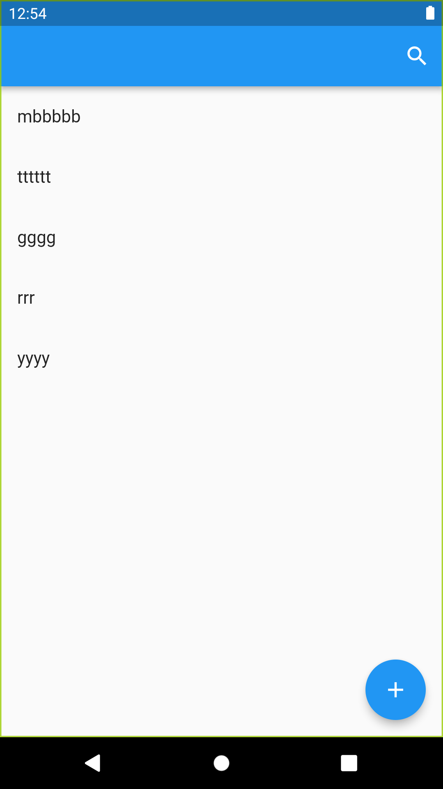
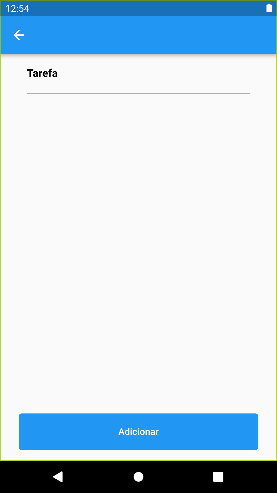

# Tasks
Para construir o projeto, é necessário adicionar a linha "flutter.minSdkVersion =19" no arquivo local.properties. Depois disso, basta executar o comando "flutter run".

## Screens

Listagem de tarefas             |                     Adicioar Tarefa                     |                 
:-------------------------:|:-------------------------------------------------------:
  | 

## Funcionalidades
- Listagem de tarefas
- Pesquisar por tarefa
- Adicinar tarefa
- Editar tarefa

## Estrutura de pastas


```  
lib  
└───reference  
│   └───features  
│   │	└───feature1  
│   │  	│   └───sub_feature  
│   │   │   └───data  
│   │   │   └───domain  
│   │   │   └───external  
│   │   │   └───presenter  
│   │   └───feature2  
│   │  	│   └───sub_feature  
│   │  	│   └───data  
│   │  	│   └───domain  
│   │  	│   └───external  
│   │  	│   └───presenter  
│   app_module.dart  
│   app_widget.dart 
```  

## Arquitetura do projeto
- Clean Architecture
- MVVM

## Libs
- dartz:
  - Usado para auxilar no tratamento de erros.
- cloud_firestore:
  - Usado como baco de dados remoto
- mockito:
  - Usado para mocar os dados nos testes unitários
- flutter_bloc:
  - Principal gerenciamento de estado da aplicação
- get_it:
  - Injeção de dependências

## Dispositivos usados nos testes
- Android:
  - Moto G6
  -  Moto G5
  -  Pixel 2 (Emulador)
- IOS:
  -  Não testado
